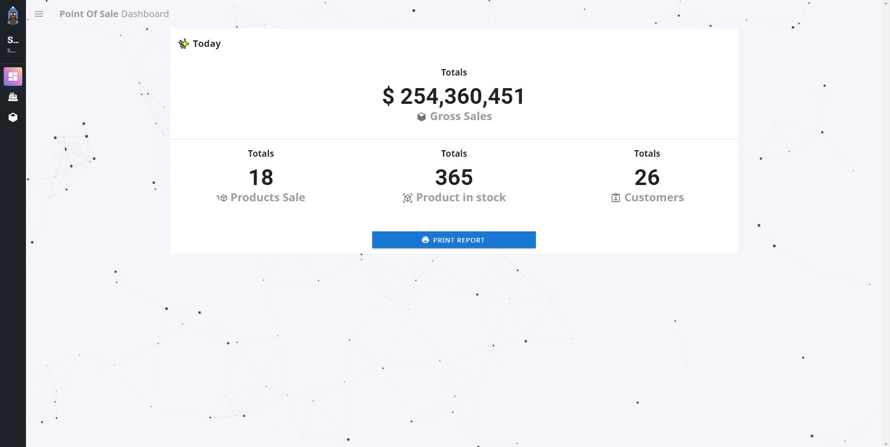
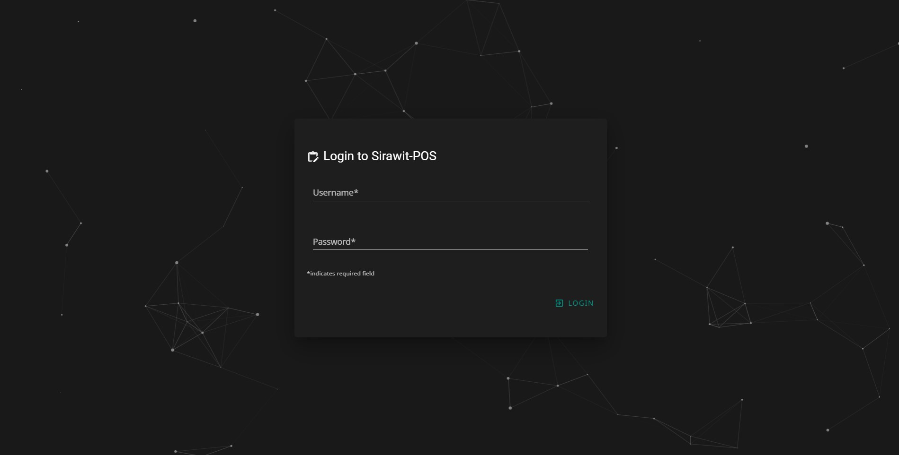

# ⛺ pos-market (fake data)
---

**✨ live demo (in progress😃)**

**Check this out!** -> https://pos-sirawit.netlify.app

---
✔️ **Check lists**

*Frontend*
- [x] ( monitoring total sale,
  products, customers,
  lastest customer history)
- [x] Report (sales summary, customer summary)
- [x] Quick keys and product lookup 
  (quickly search, filter, and add products)
- [x] Payment page (permission ADMIN)
- [x] Login, Register, and Logout pages

*Backend(with realtime database if possible)*
- [ ] Login & Register, Logout
- [ ] User Accounts and permissions.
- [ ] Customer purchase history
- [ ] Customer management
 Insert,Fetch,Update, and Delete Customer.
- [ ] Product management
 Insert,Fetch,Update, and Delete Product.

 ---
 *Pictures*
 **Login page**
 
 Made with ❤️ by Sirawit Pratoomsuwan